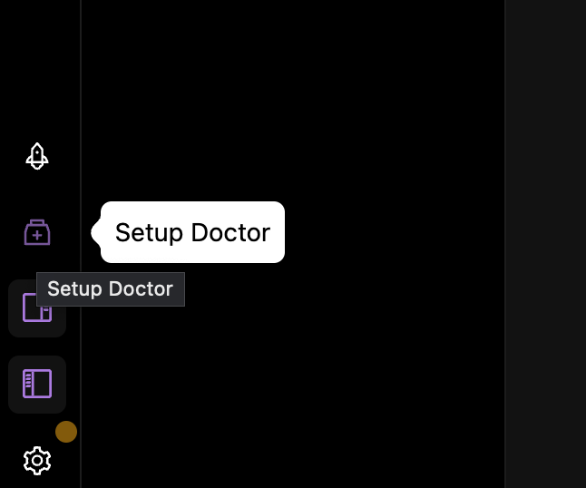
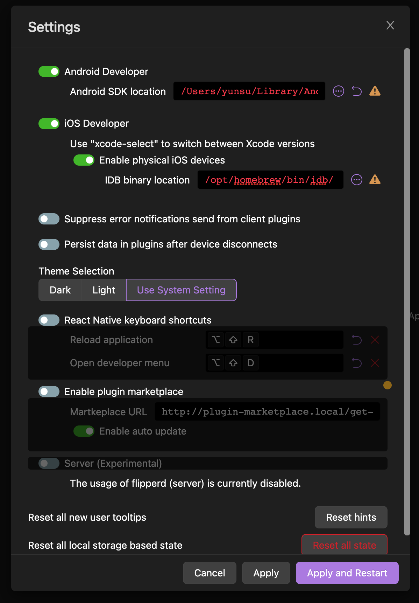

<figure>

</figure>

# Flipper

<a href="https://fbflipper.com/" target="_blank" rel="noopener">Flipper</a>는 PC에서 사용하는 클라이언트와 모바일 플랫폼 SDK로 이루어진 디버깅 플랫폼이다.
페이스북에서 개발했으며, 클라이언트는 Electron으로 만들었고 Android와 iOS, React Native를 모두 지원한다.

React Native 로 앱을 개발하면서 마주치는 여러가지 불편한 점 중 가장 큰 부분은 기본으로 제공하는 웹 디버거가 매우 불편하다는 것이다.

`console.log` 에 의존한 디버깅, 에러 발생 시 어떤 파일의 어떤 컴포넌트의 어떤 요소에서 발생했는지 쉽게 알수 없다는 것, 그리고 웹 개발자 도구에서는 확인할 수 없는 네트워킹 탭의 서버와의 API 통신 등 다양한 불편함이 있다.

Flipper는 이런 불편함을 **대부분** 해소할 수 있다.

<figure>


<figcaption>Fig 1. 컴포넌트 디버깅</figcaption>
</figure>

<br>

<figure>

<figcaption>Fig 2. 네트워크 디버깅</figcaption>
</figure>

<br>

<figure>

<figcaption>Fig 3. 로그 디버깅</figcaption>
</figure>

<br>

<figure>

<figcaption>Fig 4. Hermes Debugger</figcaption>
</figure>

# 설치

<a href="https://fbflipper.com/" target="_blank" rel="noopener">Flipper</a> 홈 페이지에서 PC에 맞는 다운로드 방식을 선택하여 다운로드한다.

<figure>

</figure>

설치를 완료하면 위와 같이 첫 화면을 마주할 수 있다.

Flipper는 초기 세팅 없이 사용하면 여러 에러로 인해 디버거 실행이 불가능한 경우가 많다. 그래서 초기 설정을 해줘야 한다.

<figure>

</figure>

좌측 하단 Setup Doctor 로 들어가면 아래와 같은 모달을 마주치게 된다.

<figure>

</figure>

각기 다른 운영체제와 환경설정을 가진 사용자에 따라 OpenSSL 이 미설치 되어 있는 경우도 있고, Watchman 이 미설치 되어 있는 경우 등 여러 경우가 있다.

이는 해당 툴이 실제로 미설치되어 있는 경우가 있고, 설치되어 있지만 경로 설정을 해주지 않아서 생기는 에러이다.

<figure>

</figure>

<figure>

</figure>

나는 초기 세팅 시 Android SDK Installed 에 에러 표시가 들어왔고, IDB Installed 에 경고 표시가 들어왔다.

**iOS Development Bridge(IDB)**는 iOS 시뮬레이터 및 실제 디바이스를 자동화하기 위한 다목적 도구이다.

<figure>

</figure>

초기 세팅을 위해 우측 하단 톱니를 클릭 후, Settings 에 진입한다.

<figure>

</figure>

나는 **Android SDK location** 이 잘못 지정되어 있었고, **IDB** 는 설치되지 않아 위와 같은 에러가 발견되었다.

### Android SDK Location

환경 변수 설정 파일을 확인한다.

```shell
cat ~/.zshrc
# bash 사용할 경우 cat ~/.bashrc
```

<br>

<figure>

</figure>

위와 같이 환경 변수에 `ANDROID_SDK_ROOT` 가 이미 존재한다면 위 경로가 Android SDK Location 이 될 것이다.

만약 존재하지 않는다면

```shell
which adb
```

<br>

<figure>

</figure>

위 명령어의 결과 값 에서 마지막 `/platform-tools/adb` 를 지운 값이 Android SDK Location 이 될 것이다. 명령어가 실행되지 않는다면 먼저 `adb` 를 설치해야 한다.

### IDB

**iOS Development Bridge(IDB)**는 iOS 시뮬레이터 및 실제 디바이스를 자동화하기 위한 다목적 도구이다.

필수적으로 설치하여 경로를 지정할 필요는 없지만, 경고 표시가 거슬리므로 설치했다.

```shell
brew tap facebook/fb
brew install idb-companion
pip3 install fb-idb
```

위 명령어로 IDB 를 설치한다.

```shell
which idb
```

<br>

<figure>


</figure>

설치 완료 후 위 경로를 Settings 에 입력 후 Flipper를 재시작한다.

<figure>

</figure>

셋업이 모두 완료되었고, 이제 React Native 프로젝트를 실행하면 안드로이드 에뮬레이터 혹은 iOS 시뮬레이터가 Flipper 에 잡힐 것이다.

<figure>

</figure>

# Plugins

Flipper 의 다양한 기능들 중 하나는 다양한 플러그인을 지원한다는 것이다.

플러그인 설치는 Flipper 좌측 탭에서 확인할 수 있다.

<figure>

</figure>

그 중에서 나는 `redux-debugger` 와 `async-storage-debugger` 를 설치했다.

<figure>


</figure>

Flipper 클라이언트에서 플러그인을 설치했다면 내 프로젝트에도 설치해야 한다.

```shell
npm i react-native-flipper redux-flipper rn-async-storage-flipper @react-native-async-storage/async-storage --force
```

<br>

<figure>

</figure>

위와 같이 하면 Flipper 클라이언트에서 Redux 디버깅 등 다양한 디버깅을 수행할 수 있다.

<figure>

</figure>

---

### Reference

- <a href="https://fbflipper.com/" target="_blank" rel="noopener">Flipper</a>
- <a href="https://www.npmjs.com/package/rn-flipper-async-storage-advanced" target="_blank" rel="noopener">Flipper Async Storage</a>
- <a href="https://www.npmjs.com/package/redux-flipper" target="_blank" rel="noopener">Flipper Redux Debugger</a>
