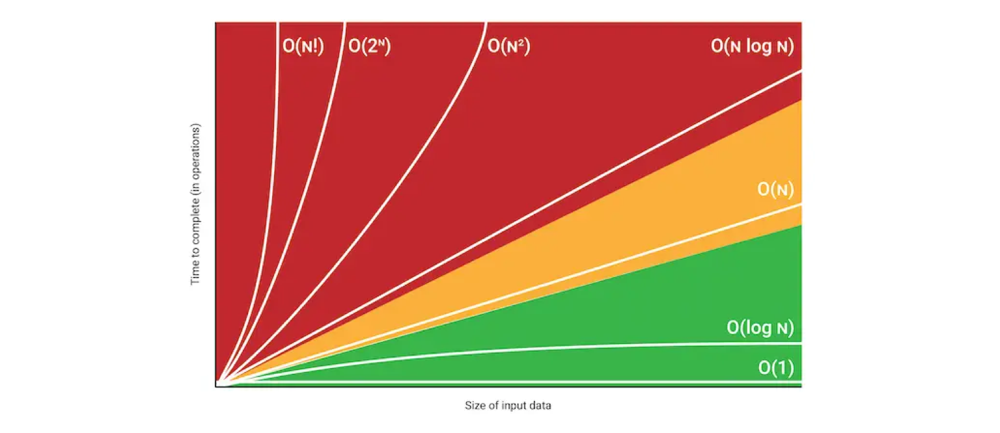

# 시간 복잡도

<a href="https://ko.wikipedia.org/wiki/%EC%8B%9C%EA%B0%84_%EB%B3%B5%EC%9E%A1%EB%8F%84">시간 복잡도</a>는 문제를 해결하는데 걸리는 시간과 입력의 함수 관계를 가리킨다.

시간 복잡도는 한마디로, 내가 짠 코드가 얼마나 효율적인지, 코드의 실행 시간을 예측한 개념이다. 이 실행 시간은 코드의 연산이 많아질 수록 증가한다.

단순한 덧셈, 뺄셈 등 기본적인 연산 외에, 개발자라는 직함을 갖고 일하기 위해선 코드가 잘 작동하는 것은 기본이고, 이 코드를 얼마나 효율적으로 짤 수 있는지 항상 고민해야한다...

시간 복잡도는 통상적으로 `빅 오 표기법(Big O)`으로 표현한다. 입력으로 들어온 데이터의 증가율에 따른 알고리즘 성능을 예측하는 데 사용된다.

<figure>

<figcaption>Fig 1. 시간 복잡도 퍼포먼스 그래프</figcaption>
</figure>

위 도표는 입력 데이터의 크기의 증가에 따른 알고리즘 구현 시간을 시각화한 자료이다.

입력 데이터의 크기가 늘어날 수록 시간이 기하 급수로 증가하는 그래프가 있는가 하면, 완만하거나 아예 변화가 없는 그래프가 있다.

### Reference

- <a href="https://ko.wikipedia.org/wiki/%EC%8B%9C%EA%B0%84_%EB%B3%B5%EC%9E%A1%EB%8F%84" target="_blank" rel="noopener">시간 복잡도</a>
- <a href="https://velog.io/@raram2/big-o-notation-and-time-complexity" target="_blank" rel="noopener">빅오 표기법과 시간 복잡도 계산, 그리고 알고리즘 개선하기</a>
