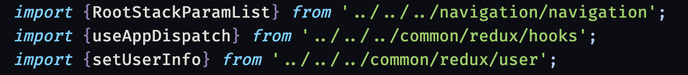
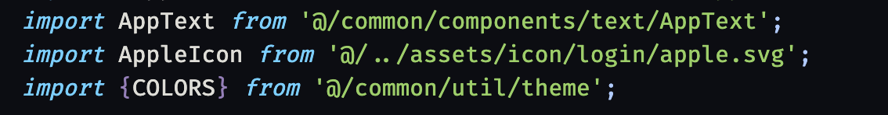

이미지 파일이나 리액트 컴포넌트, 함수 등을 `import` 로 가져올 때 그 파일의 상대 경로를 통해 가져올 수 있다.

<figure>

<figcaption>Fig 1. 상대 경로의 문제점</figcaption>
</figure>

위 사진은 그렇게 길지 않지만 만약 수많은 폴더와 폴더 속에 위치한 파일을 가져오게 되면 굉장히 길고 복잡한 상대 경로를 입력해야 한다.

이는 매번 `import` 할 때마다 피곤할 뿐 더러 보기에도 좋지 않다. 또한 파일의 위치가 어디에 있는지 한 눈에 파악하기 어렵다.

**절대 경로**를 설정하여 파일의 위치를 쉽게 파악할 수 있고, 보기에도 편하고 사용하기에도 편한 개발 환경을 만들 수 있다.

# babel-plugin-module-resolver

절대 경로 설정을 위해 babel 의 alias 를 변경해야 한다. 이를 위해 라이브러리를 설치한다.

```shell
yarn add --dev babel-plugin-module-resolver
```

<br>

# babel.config.js

타입스크립트 기반의 리액트 네이티브 프로젝트의 root 디렉토리에 있는 `babel.config.js` 를 수정한다.

```js
module.exports = {
  presets: ['module:metro-react-native-babel-preset'],
  plugins: [
    [
      'module-resolver',
      {
        root: ['./src'],
        extensions: [
          '.ios.ts',
          '.android.ts',
          '.ts',
          '.ios.tsx',
          '.android.tsx',
          '.tsx',
          '.jsx',
          '.js',
          '.json'
        ],
        alias: {
          '@': './src',
          '@common': './src/common',
          '@navigation': './src/navigation',
          '@screen': './src/screen'
        }
      }
    ]
  ]
};
```

`alias` 부분에 절대 경로 설정을 원하는 파일의 경로를 입력한다.

# tsconfig.js

root 디렉토리의 `tsconfig.js` 를 수정한다.

```js
// prettier-ignore
{
  "compilerOptions": {
    /* Visit https://aka.ms/tsconfig.json to read more about this file */
    ...

    "baseUrl": "./src",
    "paths": {
      "@/*": ["./*"],
      "@common/*": ["common/*"],
      "@navigation/*": ["navigation/*"],
      "@screen/*": ["screen/*"],
    }
  },
  "exclude": [
    "node_modules",
    "babel.config.js",
    "metro.config.js",
    "jest.config.js"
  ]
}
```

이제 절대 경로 설정이 모두 끝났다. 바로 프로젝트에 적용될 수도 있지만 안되는 경우도 있다.

```shell
yarn start --reset-cache
```

캐시를 리셋하고 다시 빌드하면 절대 경로가 적용되어 있다.

<figure>

<figcaption>Fig 2. 적용된 절대 경로</figcaption>
</figure>
