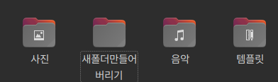

# CLI (Ubuntu)

지금까지 경험해본 OS는 윈도우밖에 없었다. 하지만 웹 개발을 더 배우기 위해 Linux 운영체제를 처음 경험해보았다.

가장 먼저 Ubuntu를 보며 느낀 점은 **' UI가 윈도우보다 멋지다. '** 라는 것이었다.

그러나 공부하며 알게된 점은 ' 이 멋진 UI보다 더 멋진 **'터미널'**이 있다! ' 는 것이었다.

윈도우에서도 터미널을 사용할 수 있지만, 지금까진 대부분 바탕화면, 윈도우 탐색기를 사용했는데, 터미널을 사용한다면 생산성을 높일 수 있다는 것을 알게됐다!

1. 바탕화면 마우스 우클릭
2. '새 폴더' 클릭
3. '폴더 이름 변경'

`GUI(Graphic User Interface)` 상에선 위와 같은 흐름으로 폴더를 만들었다면

<figure>

<figcaption>Fig 1. 새 폴더 생성</figcaption>
</figure>

이렇게 터미널에 단 한 줄! 만 입력하면 폴더 생성부터 원하는 이름으로 만들 수 있다.

추가로, 삭제 또한 간단하게

<figure>

<figcaption>Fig 2. 폴더 삭제</figcaption>
</figure>

터미널에 명령어를 입력하는 것로 수행할 수 있다.

### 자주 쓰이는 CLI 명령어

|                      명령어                      |                수행 기능                 |
| :----------------------------------------------: | :--------------------------------------: |
|                      `pwd`                       |              현재 위치 확인              |
|                     `mkdir`                      |          새 디렉토리(폴더) 생성          |
| `mkdir -p [디렉토리명/디렉토리명/디렉토리명...]` |            여러 디렉토리 생성            |
|                       `ls`                       | 디렉토리 내부의 폴더 또는 파일 목록 출력 |
|                     `ls -a`                      |   숨겨진 폴더 또는 파일 목록 모두 출력   |
|               `nautilus` (Ubuntu)                |             파일 탐색기 실행             |
|                   `cd <경로>`                    |       원하는 경로의 디렉토리 진입        |
|                 `touch <파일명>`                 |                파일 생성                 |
|                  `cat <파일명>`                  |             파일의 내용 출력             |
|                  `rm <파일명>`                   |                파일 삭제                 |
|                  `cp <파일명>`                   |                파일 복사                 |
|                  `mv <파일명>`                   |          파일 이동 및 이름 변경          |
|                 `nano <파일명>`                  |      nano 텍스트 에디터로 파일 실행      |

### Reference

- <a href="https://velog.io/@devyang97/Linux-%EB%AA%85%EB%A0%B9%EC%96%B4-%EC%A0%95%EB%A6%AC-Ubuntu-%EC%82%AC%EC%9A%A9" target="_blank" rel="noopener">Ubuntu CLI 명령어 모음</a>
