<figure>
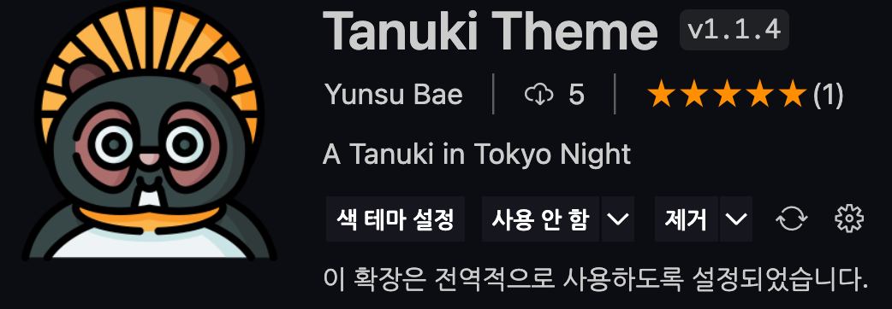
<figcaption>Fig 1. Tanuki Theme</figcaption>
</figure>

# 개요

기존 사용하던 VSCode 테마가 질려 새로운 테마를 찾아보았다. 썩 마음에 드는 테마가 없어서 직접 만들어보자 하는 생각으로 만들게 되었다.

커스텀 테마를 만들고 배포하는 방법은 이 <a href="https://medium.com/wearelaika/vscode-create-your-own-custom-theme-extension-96c67bd753f6" target="_blank" rel="noopener">블로그</a>를 참고하여 작성했다.

# 테마 생성

```cli
npm install -g yo generator-code
```

`yo` 라는 이름의 패키지를 설치한다. 터미널을 열고 아래와 같이 입력하여 나만의 테마를 만들 수 있다.

```cli
yo code
```

<figure>
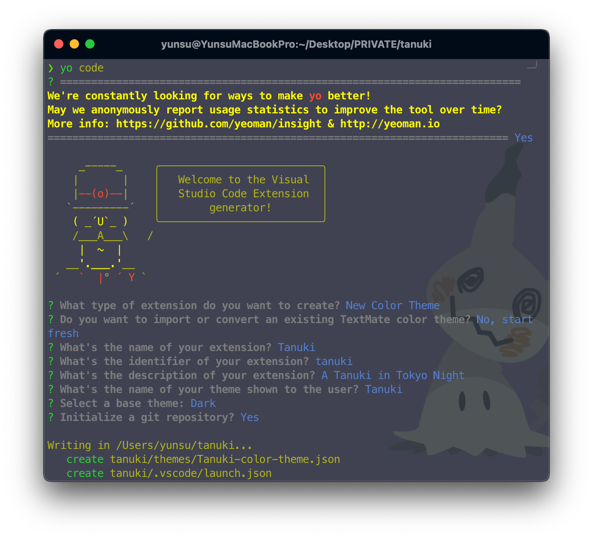
</figure>

<figure>
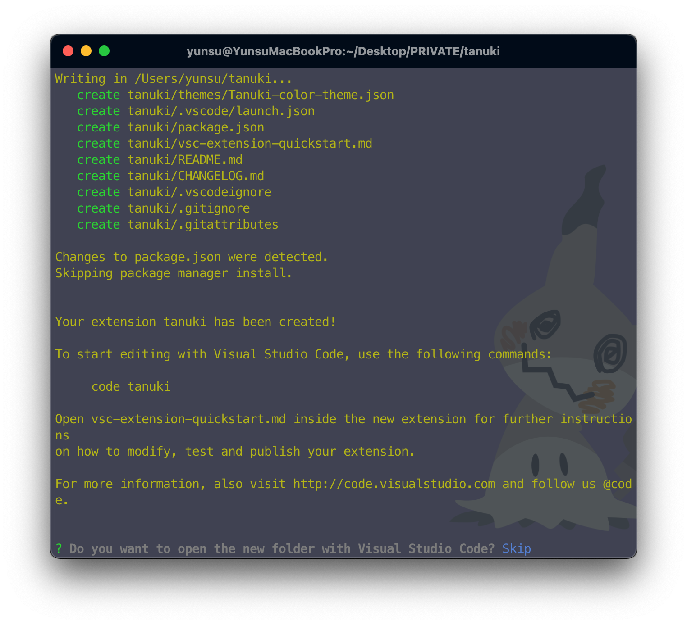
<figcaption>Fig 2. yo 패키지 설치 후 yo code 실행</figcaption>
</figure>

터미널에 위와 같이 확인할 수 있다. 묻는 질문에 하나하나 답변을 입력하면 입력한 답변의 이름으로 폴더가 생성된다.

<figure>
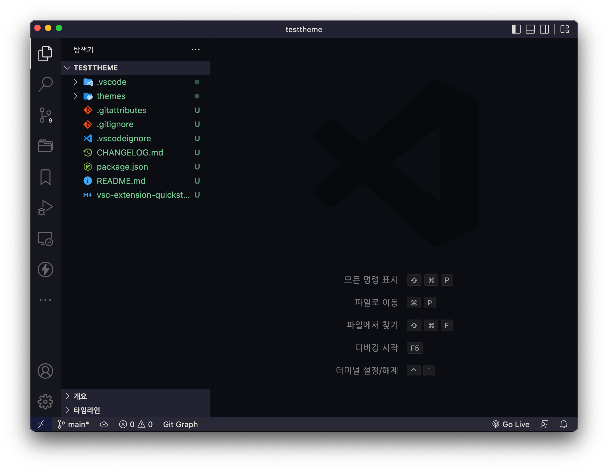
<figcaption>Fig 3. 생성된 폴더의 탬플릿</figcaption>
</figure>

<br>

<figure>
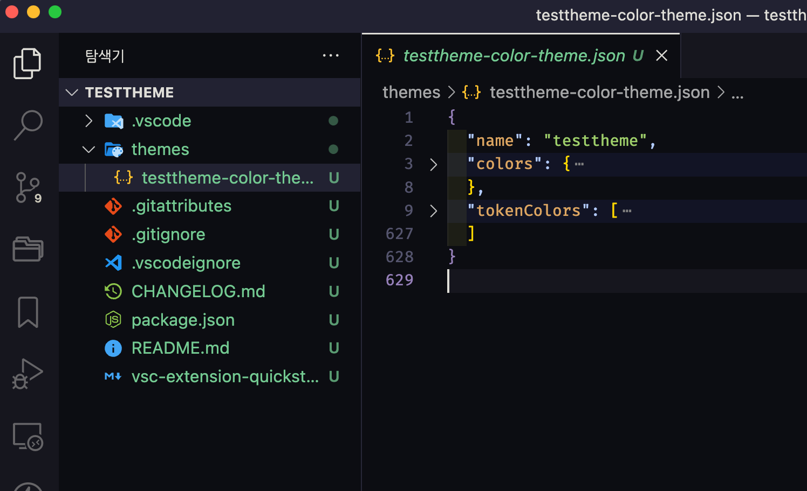
<figcaption>Fig 4. 테마 커스터마이징 JSON 파일</figcaption>
</figure>

생성된 폴더의 구조는 위와 같으며, 테마 커스터마이징은 `[테마 이름]-color-theme.json` 에서 수행한다.

JSON 파일의 `colors`는 VSCode 에디터 전반적인 스타일링을 수행한다. (타이틀 바, 에디터 배경, 사이드바, 터미널 색상 등)

`tokenColors` 는 에디터에 입력하는 코드의 스타일링을 수행한다. (주석의 색, HTML 태그의 색, 변수나 함수 이름의 색 등)

각각 스타일링에 필요한 컴포넌트의 이름은 <a href="https://code.visualstudio.com/api/references/theme-color" target="_blank" rel="noopener">VSCode Theme Color 공식 문서</a> 에서 확인할 수 있다.

테마 커스터마이징을 하면서 내가 적용한 스타일을 확인하려면 `F5` 로 디버거를 실행하여 확인할 수 있다.

커스터마이징이 완료되면 `package.json` 을 수정해야 한다.

<figure>
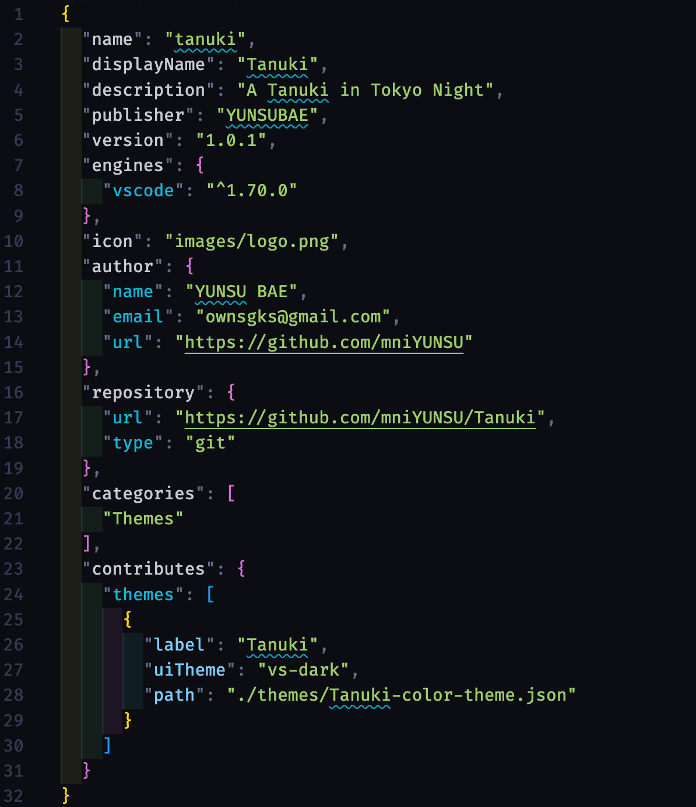
<figcaption>Fig 5. package.json</figcaption>
</figure>

`name` 은 테마의 고유 이름이다.

`displayName` 은 VSCode 익스텐션에 마켓 플레이스에서 검색할 때 노출되는 이름이다.

`description` 은 테마의 설명문이다.

`publisher` 은 퍼블리셔의 이름으로, 잠시 후에 생성해야 한다.

`version` 은 테마의 버전이다. 수정 사항이 있을 경우 버전을 수정하여 퍼블리싱해야 한다.

`engines` 은 테마가 작동할 VSCode의 버전이다. 너무 최신 버전으로 설정하면 사용자들이 설치했을 때 버전이 맞지 않아 적용이 안될 수 있으므로, 적당히 낮은 버전을 입력한다.

`icon` 은 마켓 플레이스에서 보이는 테마의 아이콘이다.

`author` 은 테마를 만든 사람에 대한 정보다.

`repository` 는 테마가 기록된 저장소를 나타낸다. 테마를 퍼블리싱 하기 전에 패키징을 하는데 이 `repository` 항목이 없다면 수동으로 url 을 입력해야 한다. 입력하면 패키징할 때 자동으로 `repository`에 입력한 url 을 인식하여 패키징을 수행한다.

`categories` 는 익스텐션의 분류이다. 테마이므로 `Themes` 로 폴더가 만들어질 때 자동으로 입력된다.

이렇게 `package.json` 까지 입력하면 패키징 후 배포할 준비가 되었다.

# 퍼블리셔 생성 및 토큰 발급

그 전에, <a href="https://dev.azure.com" target="_blank" rel="noopener">Azure</a> 계정을 생성해야 한다. VSCode 익스텐션들은 <a href="https://dev.azure.com" target="_blank" rel="noopener">Azure</a>를 사용하여 마켓 플레이스에 배포할 수 있다. 퍼블리셔 계정 은 <a href="https://dev.azure.com" target="_blank" rel="noopener">이 링크</a>에서 생성할 수 있다.

<figure>
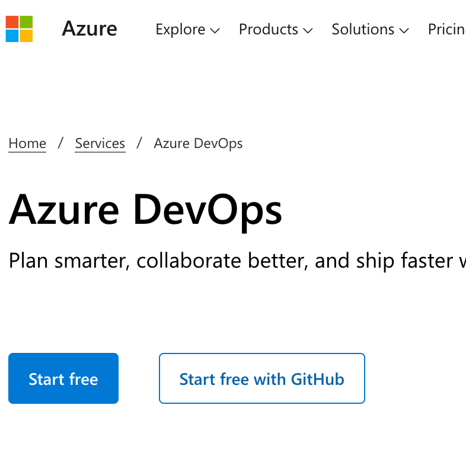
<figcaption>Fig 6. dev.azure.com</figcaption>
</figure>

<br>

계정을 생성하면 우측 상단의 메뉴에 들어가 **Personal Access Token** 을 발급 받아야 한다.

<figure>
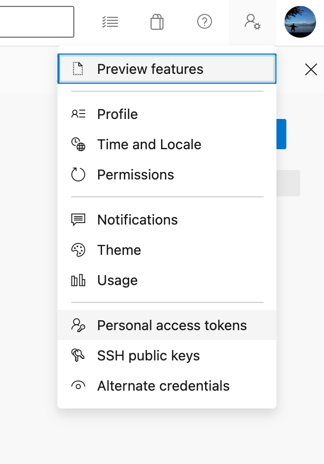
</figure>

<br>

<figure>
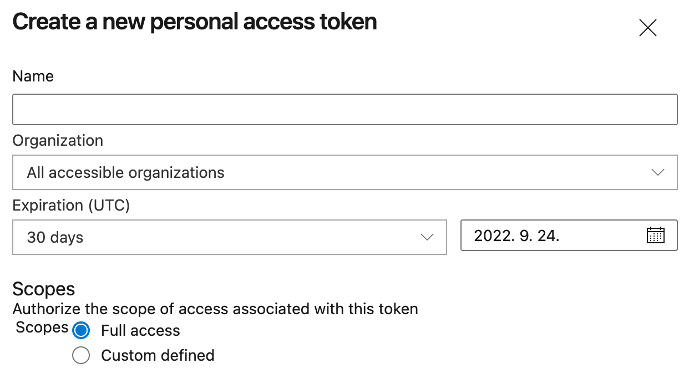
<figcaption>Fig 7. Personal Access Token</figcaption>
</figure>

<br>

위와 같이 토큰까지 생성 후, 토큰은 개인적인 공간에 메모해둬야 한다.

이제 퍼블리셔 계정을 생성해야 한다. 터미널로 생성할 수 있지만, <a href="https://marketplace.visualstudio.com/manage/createpublisher" target="_blank" rel="noopener">마켓 플레이스</a>에서 쉽게 생성할 수 있다.

<figure>
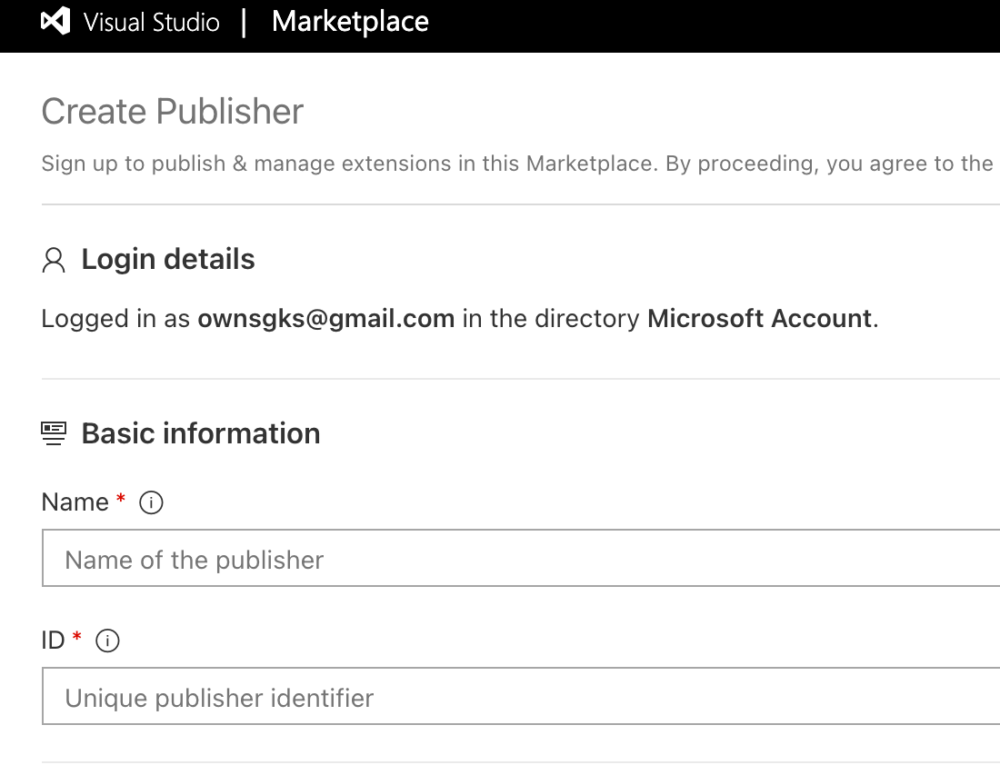
<figcaption>Fig 8. Create Publisher</figcaption>
</figure>

퍼블리셔를 생성 후, `package.json` 의 `publisher` 는 **생성할 때 입력한 ID 를 입력해야 한다. Name이 아니다.**

# 패키징 및 퍼블리싱

이제 만든 테마를 패키징 후 퍼블리싱만 하면 된다. 그 전에 생성한 테마를 GitHub 에 푸시해야 한다.

```cli
npm install vsce -g
```

패키징과 퍼블리싱을 위해 필요한 패키지이다.

```cli
vsce login (publisher id)
```

위 커맨드를 실행하면 토큰을 입력하라는 메시지가 출력된다. 이전에 생성해 둔 Personal Access Token 을 입력한다.

```cli
vsce package
```

<br>

```cli
vsce publish
```

<figure>
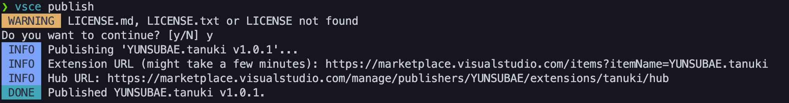
</figure>

<br>

<figure>
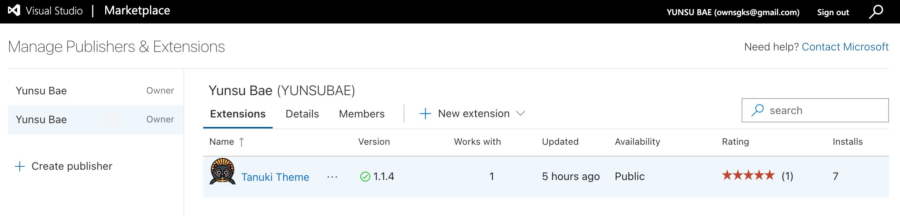
<figcaption>Fig 9. Tanuki Theme</figcaption>
</figure>

위 과정이 완료되면 퍼블리싱까지 마무리 된다. 약 5분 뒤에 마켓 플레이스에서 자신이 퍼블리싱한 테마를 확인할 수 있다.

<figure>
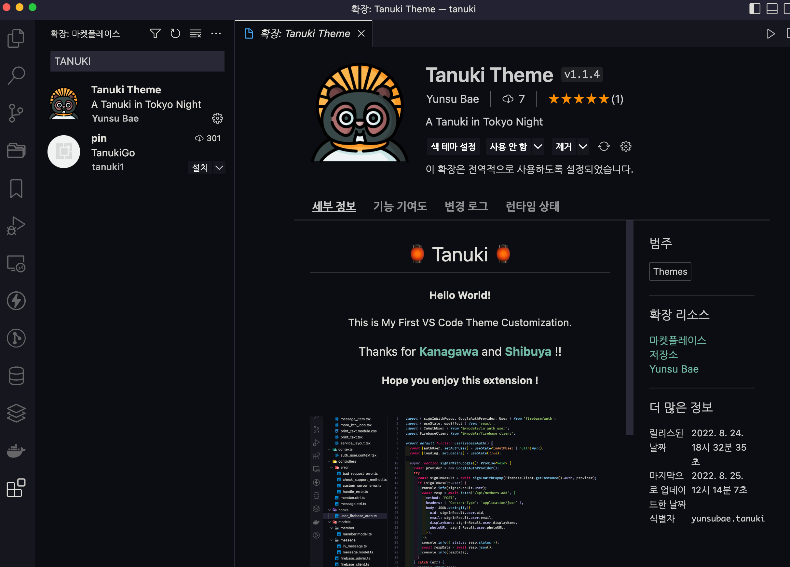
</figure>

<figure>
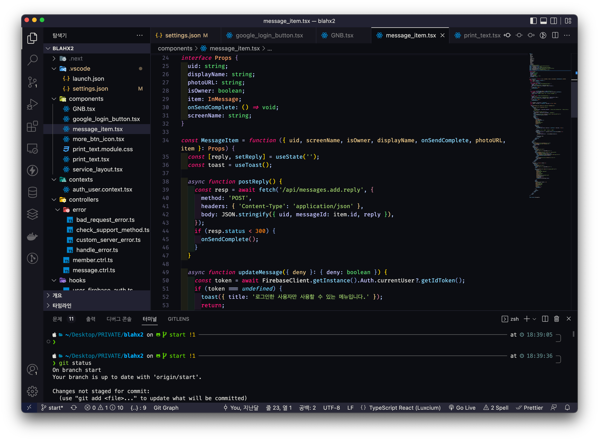
<figcaption>Fig 9. Tanuki Theme</figcaption>
</figure>

### References

- <a href="https://code.visualstudio.com/api/references/theme-color" target="_blank" rel="noopener">VSCode Theme Color 공식 문서</a>
- <a href="https://medium.com/wearelaika/vscode-create-your-own-custom-theme-extension-96c67bd753f6" target="_blank" rel="noopener">참고한 블로그</a>
