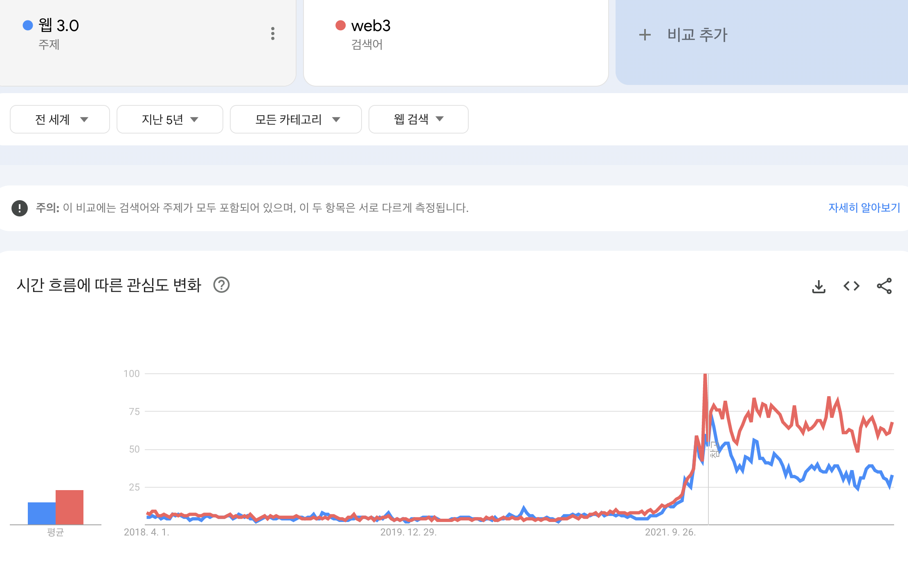
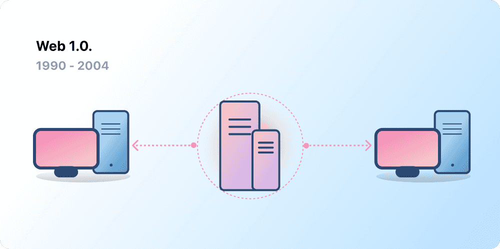
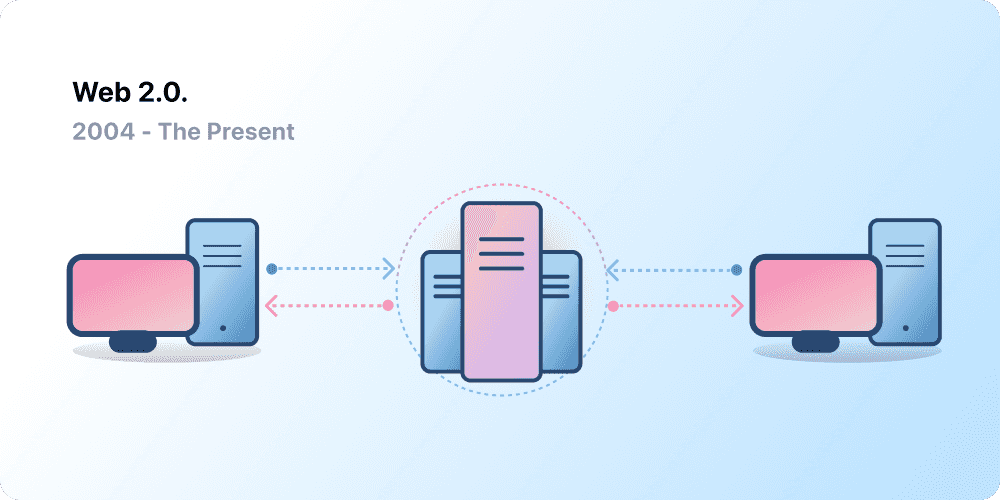
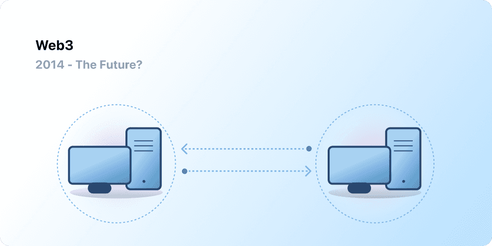
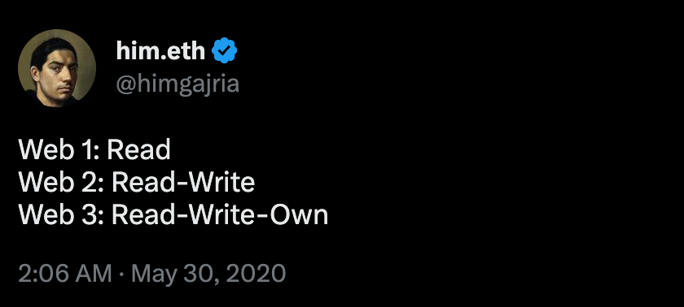

# 개요

**Web3(Web3.0)** 라는 용어가 근 2~3년 전 부터 심심치 않게 눈에 띄고 있다.

개발적으로나 마케팅적으로나 다양한 분야에서 쓰이고 있고 그 빈도가 점점 늘어나고 있다.

<figure>

<figcaption>Fig 1. Web3 의 검색 동향</figcaption>
</figure>

실제로 통계상으로도 2021년 부터 사람들의 관심도가 급격히 상승한 것을 알 수 있다.

이러한 통계의 근거는 2021년 부터 대유행이었던 **대체 불가능 토큰(Non-Fungible Token, NFT)** 의 영향이 가장 컸다.

NFT는 **블록체인** 기술을 활용하여 특정한 디지털 자산(그림, 영상 등)의 **소유주를 증명**하는 가상의 **토큰**이다. 현실의 미술품처럼 디지털 자산의 진품 가품을 판별할 수 있는 일종의 가상 진품 증명서이다.

이러한 NFT의 대유행은 곧 "**NFT로 무엇을 할 수 있는데?**" 라는 질문으로 이어졌고, 그 대답 중 하나가 이 NFT를 활용하여 사용자로 하여금 소유권이라는 특정한 **권한을 부여한다는 것** 이었다. 그 결과 Web3 라는 개념이 세상에 나왔다. 나는 이것이 Web3 관심도의 상승에 대한 주요한 요인이라고 생각한다.

 

<a href="https://ethereum.org/ko/web3/" target="_blank" rel="noopener">이더리움 공식 사이트에서 소개하는 Web3</a>는 다음과 같다.

> **중앙화 방식**은 수많은 사람이 웹을 사용할 수 있게 도와주었고, **안정적이고 거대한 인프라**를 만들 수 있었습니다.
>
> 동시에 소수의 **중앙화된 기관**들은 허용되어야 하는 작업을 결정하는 데 있어 **일방적으로 정보를 통제**하기도 합니다.
>
> **웹3로 바로 이 문제를 해결할 수 있습니다.**
>
> 웹3에서는 거대 테크 기업들이 일괄적으로 관리되지 않고, **탈중앙화** 방식을 통해 사용자가 직접 시스템을 만들고, 운영, 소유합니다.
>
> 웹3는 거대 기업이 아닌 **개인들에게 권력을 분산**합니다.

위 글에 따르면 우리가 지금까지 흔히 사용하던 서비스는 안정적이고 거대한 인프라를 가진 중앙화된 기관들이 제공하는 서비스이다. 그리고 서비스를 제공하는 기업들은 일방적으로 정보를 통제한다는 문제를 제기하고 있다.

이 문제와 관련된 과거 사례가 있었을지 생각해보았다.

- **주식거래 서비스 로빈후드의 특정 주식 매수 차단** 
  로빈후드는 2021년 게임스탑(GME)의 주가 폭등으로 매수와 같은 특정 서비스를 불가능하게 막았다.
  주식시장은 기본적으로 투기 과열을 방지하기 위한 **서킷 브레이커**나 **사이드카** 제도가 있다.  그러나 이 사례는 주식거래 서비스를 제공하는 **기업의 자체적인 판단으로 서비스를 차단**했다는 데에 있다.  
- **트위터의 특정 계정 영구정지** 
  트위터는 2021년 **도널드 트럼프 미국 대통령**의 트위터 계정을 영구정지 조치했다. 근거는 "추가로 폭력을 조장할 위험이 있다."는 것이었다. 이와 관련해 잘했다는 의견이 그 당시 지배적이었다.  그러나, 독일의 메르켈 총리는 "**표현의 자유**라는 기본권은 근본적인 권리로 법률과 입법기관이 정의내린 테두리 내에서 제한될 수 있으며, **소셜미디어 플랫폼 기업의 결정에 따라서는 안 된다.**" 라며 트럼프가 아닌 **테크 기업을 향해** 메세지를 던졌다.

위 사례는 2021년 한 때 세간을 떠들썩하게 하던 큰 사건들이었다.

실제로 위와 같은 사례들은 이슈화된 일부 사례에 불과하다. 중앙화된 기관은 실제로 일방적으로 정보를 통제하는 경우가 비일비재하다.

<figure>

</figure>

나는 이 사건들이 대중들의 Web3 에 대한 관심도 상승에 일부 기여했다고 생각한다.

 

이러한 문제들을 중앙화되지 않은, 즉 **탈중앙화** 방식을 통해 서비스의 관리 및 통제 **권한**을 사용자에게 주는 것으로 개인에게 권력을 분산한 Web3로 해결할 수 있다고 이더리움은 말하고 있다.

Web3를 알아보기 전에, 기존 Web1.0 과 Web2.0 을 먼저 정리해보려 한다.

# Web1.0 (1990 ~ 2004) : 읽기

웹의 아버지라고도 불리는 <a href="https://namu.wiki/w/%ED%8C%80%20%EB%B2%84%EB%84%88%EC%8A%A4%EB%A6%AC" target="_blank" rel="noopener">팀 버너스 리</a>는 전 세계에서 정보를 공유함으로써 분리된 세계를 하나로 묶기 위해 `www` 라는 프로토콜을 개발했다.

<figure>

<figcaption>Fig 2. Web1.0</figcaption>
</figure>

Web1.0 또한 팀 버너스 리의 결과물 중의 하나로, 1990년에서 2004년 사이의 웹들이 이에 해당된다. Web1.0은 대부분 기업이 소유한 정적인 웹사이트이다. 이는 사용자가 콘텐츠를 생산하는 것이 아닌 오로지 읽기를 위한 웹이다. 즉, 서비스를 만든 기업이 제공하는 컨텐츠만 사용자는 읽을 수 있으며 사용자간 상호작용이 없는 **읽기 전용 웹**이다.

# Web2.0 (2004 ~) : 읽기와 쓰기

2004년 소셜 미디어 플랫폼의 등장으로 Web2.0 시대가 시작되었다. 기존 읽기만 가능했던 웹은 이제 쓰기까지 가능한 형태로 진화했다. 이는 기업이 컨텐츠를 제공하는 경우 이외에도 사용자들이 직접 만든 컨텐츠를 공유할 수 있게 되었다. 이로써 사용자 간 상호작용이 가능했고, 이를 제공하는 웹은 **플랫폼**으로써 작동했다.

<figure>

<figcaption>Fig 3. Web2.0</figcaption>
</figure>

이 결과, 사람들은 온라인에서 더 많은 활동을 할 수 있게 되었다. 또한 이러한 서비스를 제공하는 일부의 기업들은 해당 서비스에서 발생하는 막대한 **트래픽과 데이터**를 획득할 수 있게 되었다.

사용자들의 온라인 활동에서 발생하는 막대한 트래픽을 일부의 기업들은 이를 광고와 접목해 **광고 기반 수익 모델**을 탄생시키기도 했다.

즉, 사용자는 컨텐츠를 생산하기도 했고 읽기도 했고 다른 사용자들과 수많은 상호작용을 할 수 있었다. 그러나, 그러한 컨텐츠를 사용자가 소유하거나 상호작용에서 발생하는 이익을 기업으로부터 나눠 받지 못했다.

# Web3.0 : 읽기와 쓰기, 그리고 소유

<a href="https://ethereum.org/ko/what-is-ethereum/" target="_blank" rel="noopener">이더리움</a> 의 공동 창립자 개빈 우드가 이더리움을 런칭한 이후 2014년에 제안한 용어이다.

현재의 웹(Web2.0)은 서비스를 제공하는 **특정 주체**에 대한 신뢰를 기반으로 작동한다. 사람들이 일상처럼 사용하는 서비스들은 소수의 사기업이 **공공의 이익**을 위해서 행동할 것이라는 믿음이다.

개빈 우드는 이러한 부분에 문제 의식을 갖고 Web3을 통해 이를 개선하고자 했다.

<figure>

<figcaption>Fig 4. Web3.0</figcaption>
</figure>

그렇게 Web3는 Web2.0 보다 **새롭고 더 나은 인터넷**이라는 의미가 담긴 용어가 되었다. Web3의 핵심은 **블록체인, 암호화폐, NFT** 를 사용해 사용자에게 소유권이라는 형태로 **권한**을 다시 돌려준다는 것이다.

<figure>

</figure>

다시 말해, **Web1.0 은 읽기 전용, Web2.0은 읽기와 쓰기, Web3는 읽기, 쓰기, 그리고 소유**라는 것이다.

### Web3 의 핵심

Web3 는 몇 가지 핵심 원칙으로 정의할 수 있다.

#### 탈중앙화

Web3는 **탈중앙화**되어 있다. 중앙화된 주체가 인터넷의 대부분을 소유 및 제어하지 않고, **창작자와 사용자**에게 **소유권**이 분배된다.

즉, 디지털 자산에 대한 **소유권**을 과거에 없던 방식으로 제공한다. 게임을 예로 들 수 있다. Web2.0 기반 게임에서 아이템을 구매한다면 이 아이템은 구매자의 계정에 묶이게 되며, 게임이 서비스 종료가 되거나 구매자의 계정을 삭제한다면 구매한 아이템은 잃어버리게 된다. 구매한 아이템의 가치가 없어지는 것이다.

Web3라면 **NFT**를 통한 직접적인 소유가 가능해진다. 게임을 개발한 기업이더라도 그 아이템의 소유권을 가져갈 수 없고, 구매한 아이템을 오픈 마켓에서 판매 및 교환함으로써 가치를 활용할 수 있다.

#### 무허가

**Web3는 허가라는 개념이 없다**. 모든 사람이 동등한 참여 권한을 지닌다. 배제되는 사람은 없다.

Web2.0 플랫폼 서비스와 콘텐츠 창작자 간의 권력 구도는 **불균형**하다. 대부분의 플랫폼에서 활동하는 콘텐츠 창작자들은 자신이 만든 콘텐츠들을 기업의 방침에 따라 한 순간에 잃어버릴 수 있다. 또 기업에서 창작자에게 나눠주는 수익의 비율을 조정하는 것으로 창작자의 창작 의지를 꺾을 수도 있다. 즉, 창작자들은 플랫폼이 이러한 **규칙들을 바꾸지 않을 것이라는 믿음**을 가져야 한다.

Web3는 사용자의 데이터가 **블록체인 상에 존재**하게 된다. 사용자가 어떤 플랫폼을 떠나더라도 그 사용자의 데이터는 유지된다. 즉, 사용자의 명성과 팔로잉을 유지할 수 있으며, 자신이 추구하는 가치에 맞는 다른 플랫폼에서 이를 지속할 수 있다. 한 단어로 말하자면 **검열 저항력**이 있는 것이다.

Web3는 데이터를 소유하는 것 외에 **토큰**을 이용해 플랫폼을 **소유**할 권한도 가질 수 있다. **탈중앙화 자율 조직(Decentralized Autonomous Organization, DAO)**을 통해 플랫폼의 소유권을 조율하거나, 미래에 대한 의사 결정을 내릴 수 있다.

**DAO**는 **토큰을 활용한 자동화된 분산형 의사 결정을 이루어내는 동의 기반 스마트 계약**이다.

토큰을 보유한 사용자는 조직의 리소스가 어떻게 쓰여야 하는지 투표할 수 있는 권한이 있으며, **스마트 계약**에 내재된 코드를 통해 투표 결과를 자동으로 실행한다.

#### 기반 화폐

Web3는 **기반 화폐**가 있다. 기존의 은행 결제 서비스에 의존하지 않고 온라인으로 결제 및 송금이 가능한 **암호화폐**를 사용한다.

Web2.0의 결제 방식은 사용자의 은행 계좌가 없거나, 결제 서비스를 지원하지 않는 나라에 사는 사람들은 결제 서비스를 이용할 수 없다.

Web3는 이더(ETH)와 같은 **토큰**을 사용하는 것으로 브라우저에서 직접 송금할 수 있으며, 제 3자 결제 서비스 제공 업체에 의존하지 않는다.

#### 불필요한 신뢰

Web3는 컨텐츠를 제공하는 사람이나, 기업 등 **특정 주체에 대한 신뢰가 불필요**하다. 그러한 신뢰 대신에 **인센티브와 경제 매커니즘**을 통해 작동한다.

Web2.0에선 사용하는 서비스마다 계정을 매번 만들어 왔다. 인스타그램, 트위터, 유튜브 등등 각각의 계정으로 사용하고 있다. 최근에는 소셜 로그인으로도 사용할 수 있다.

이는 앞서 이야기한 검열 문제를 발생시킬 수 있다. 계정의 권한이나 계정 자체를 클릭 한 번으로 사용자의 플랫폼 활동을 제한할 수도 있다. 또한, 이러한 계정들을 만들기 위해 개인 식별 정보를 기입해야 한다. 이는 곧 이러한 정보를 다루는 플랫폼을 사용자로 하여금 신뢰할 수 밖에 없도록 요구한다.

Web3는 사용자의 이더리움 주소 정보를 통해 디지털 신원 정보를 제어하는 것으로 이러한 문제들을 해결할 수 있다. 이더리움 주소를 통해 **검열 저항력**을 가지고 있으며, 단일 로그인 방식을 통해 다양한 Web3 플랫폼에서 활용할 수 있다.

### Web3의 개선점

Web3는 위처럼 많은 장점을 갖고 있으나, 아직 극복해야 할 한계점도 많다. 또한, 위에서 언급했던 Web3의 장점들은 기존 서비스들이 충분히 반론할 만한 요소를 갖고 있다.

#### 접근성

서비스를 경험하기 위한 이더리움 로그인과 같은 중요한 Web3 기능은 무료로 누구나 사용할 수 있다. 그러나 트랜잭션의 경우 거래 수수료가 높아 아직까지 활용성이 떨어진다.

또한 블록체인의 유지 비용은 일반적인 중앙화 데이터베이스보다 비싸기 때문에 높은 비용이 발생할 수 있다.

#### 사용자 환경

Web3를 사용하기 위한 기술 진입 장벽은 높다. 보안에 대한 문제를 인식해야 하고, 복잡한 기술 문서를 이해해야 한다. 또한 더 직관적인 UI/UX를 제공해야 한다. 기존에는 데이터를 중앙 서버에서 REST API 호출을 통해 가져왔다면, Web3는 블록체인 **노드와의 상호 작용**으로 데이터에 접근하므로 Web2.0 서비스보다 느린 속도를 경험할 수 있다.

 

개빈 우드는 Web3 개념을 2014년에 제안했지만, 위 많은 아이디어들은 오늘날에 와서야 구현 가능해졌다. 아직 Web3 는 **시작 단계**에 불과하며 이 생태계를 만들어가는 수많은 사람들이 Web3 인프라를 발전시켜나가고 있다.

### References

- <a href="https://ethereum.org/ko/web3/" target="_blank" rel="noopener">Web3란 무엇입니까? - Ethereum</a>
- <a href="https://www.deutschlandfunkkultur.de/merkel-kritisiert-twitter-fuer-trump-sperre-die-doppelmoral.1008.de.html?dram:article_id=490700" target="_blank" rel="noopener">Christian Solmecke & Stephan Karkowsky, , Deutschlandfunk Kultur, 2021.1.12</a>
- <a href="https://www.spiegel.de/netzwelt/web/donald-trump-und-soziale-medien-der-perfekte-zeitpunkt-fuer-das-ende-der-extrawurst-a-35dbf1a2-1d4b-4736-9892-9dc4922645b0" target="_blank" rel="noopener">Patrick Beuth, , Der Spiegel, 2021.1.9</a>
- <a href="https://medium.com/%EB%A7%A5%EA%B0%A4%EB%9F%AC%EB%A6%AC/%EB%A1%9C%EB%B9%88%ED%9B%84%EB%93%9C%EC%9D%98-%EB%A7%A4%EC%88%98-%EC%B0%A8%EB%8B%A8%EC%9D%B4-%ED%95%80%ED%85%8C%ED%81%AC%EC%97%90-%EB%81%BC%EC%B9%9C-%EC%98%81%ED%96%A5-b708c0090817" target="_blank" rel="noopener">로빈후드의 매수 차단이 핀테크에 끼친 영향</a>
- <a href="https://namu.wiki/w/%ED%8C%80%20%EB%B2%84%EB%84%88%EC%8A%A4%EB%A6%AC" target="_blank" rel="noopener">팀 버너스 리</a>
- <a href="https://ethereum.org/ko/what-is-ethereum/" target="_blank" rel="noopener">이더리움</a>
